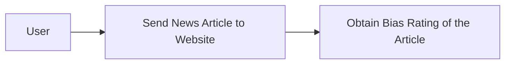
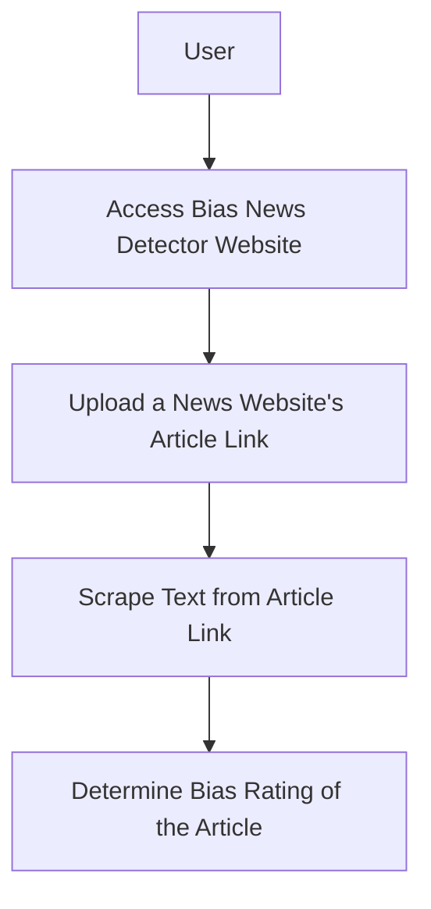
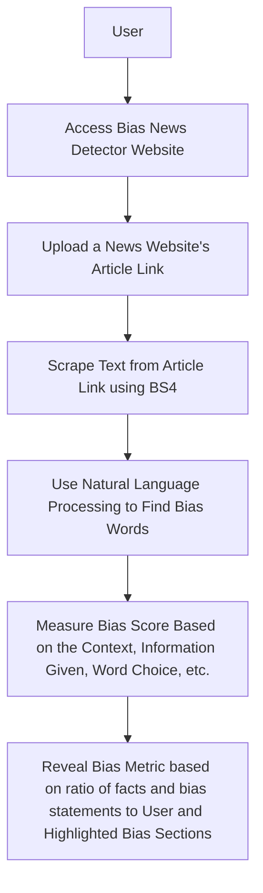

# CP_final_design_report

## Team names
- Jordan Shaheen
- Toby Knueven
- Alexander Hatton
- Cole Hutchinson

## Project Abstract
The News Bias Detector aims to promote media literacy by analyzing online news for bias. Utilizing advanced NLP and ML techniques, it scrutinizes text for language patterns indicating bias. This project, driven by the escalating concerns around misinformation, leverages Django for web development and Python for algorithmic analysis. Key features include URL input for scraping articles and real-time bias assessment. Development is informed by extensive research into bias detection methodologies, existing tools, and user interaction paradigms, ensuring a blend of technical proficiency and user-centric design. This tool aspires to be an essential aid for discerning readers in the digital age.

## Project Description

## User stories and User Diagrams
### User Stories
- As a person reading the news, I want to understand the bias of articles I read in order to come to my own understanding of topics I am interested in.
- As a Polysci student, I want a bias-metric to understand the mathmatical measurement of the bias in order to research more effectively.
- As a marketing professional, I want to understand the bias in news articles to help advertise correctly to the right audiences.

### Design Diagrams
### Design Level 0

### Design Level 1

### Design Level 2

## Project Tasks and Timeline
### Task List
- Create a formalized outline of webpage mapping and universal styling for all webpages
- Create webscraper that analyizes the news article website URL and scrapes the article text accuratly
- Create Machine Learning Natural Language Processing feature that can correctly detect bias in the scraped news article
- Create bias metric with Machine Learning to understand how bias or unbias the news article is and present the metric intuitivly to user.

### Timeline
| Task | Start Date | Planned Completion Date |
|------|------------|-----------------|
| Task 1: Webpage outline | 01/08/2024 | 01/22/2024 |
| Task 2: Webscraper | 01/22/2024 | 02/05/2024 |
| Task 3: Bias metric/training data | 02/05/2024 | 02/19/2024 |
| Task 4: ML NLP bias classifier | 02/19/2024 | 03/18/2024 |

### Effort Matrix
| Task Description | Team Member of Primary Responsibility | Shaheen Effort (%) | Hatton Effort (%) | Knueven Effort (%) | Hutchins Effort (%) |
|------------------|---------------------------------------|---------------------|---------------------|---------------------|---------------------|
| Task 1: Webpage outline | Jordan Shaheen                 | 75%                 | 25%                 | 0%                  | 0%                  |
| Task 2: Webscraper | Alexander Hatton                    | 25%                 | 75%                 | 0%                  | 0%                  |
| Task 3: Bias metric/training data  | Tobias Knueven      | 0%                  | 0%                  | 75%                 | 25%                 |
| Task 4: ML NLP bias classifier  | Colson Hutchins        | 0%                  | 0%                  | 25%                 | 75%                 |

## ABET Concerns Essay

## PPT SLideshow
https://docs.google.com/presentation/d/1co4_NATWwx58o8fNLTBt8JRdHQASSN4Hl-MjrWZ7DQw/edit?usp=sharing

## Self-Assessment Essays

## Professional Biographies

## Budget
Our budget is currently projected to be $0. We have the necessary equipment already in-hand to complete our anticapted tasks. We are aware that processing power may be a concern that we discover later on in our progress. If this concern materializes, we may opt to rent temporary virtual processors. This cost is projected to be under $50 if needed.

## Appendix
